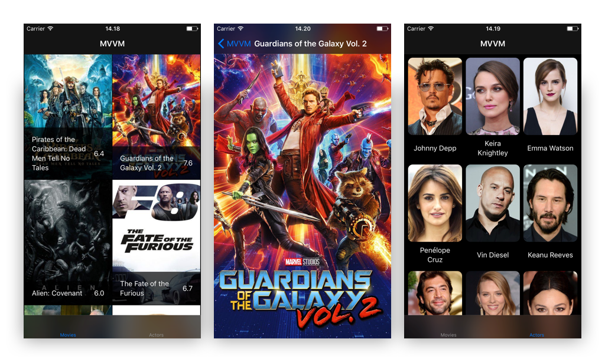
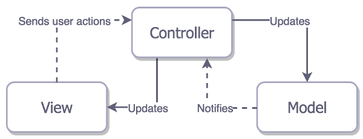
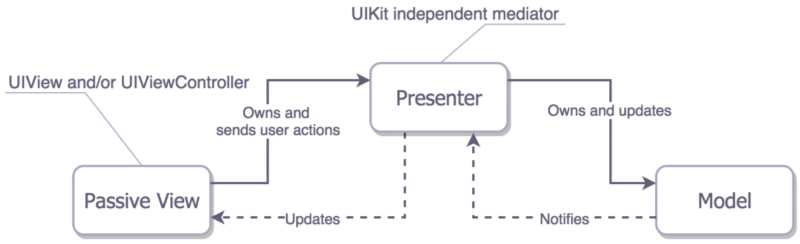

# Exploring Modern iOS Architectures

#### Project
In this project I'm structuring my knowledge about modern architectural patterns,
showcasing the main features through a simple Movie app. The app makes use of
the [Tmdb API](https://www.themoviedb.org/documentation/api) which requires an API key. However, static
`JSON` files are also included for quick usage.

#### Setup

###### Static JSON
1. In Xcode, choose a target / architecture
2. Build and run!

###### Tmdb requests
1. [Request an API key](http://https://www.themoviedb.org/faq/api) :key:
2. Insert your key in `TmdbAPIKey.plist` located at the root of `/Architectures`
3. In Xcode, choose a target / architecture
4. Build and run!

#### Architectural Questions
As I work through the architectures I will experiment with different setups while keeping the core principles of the architectures in mind. The project is designed with code readability and learning in mind, to use them in production may require performance optimisations or other changes. Some architectural aspects to consider:

:small_blue_diamond: **Orthogonality:** responsibilities, distribution, coupling etc.

:small_blue_diamond: **Ease of use:** how easy is it to set up and implement?

:small_blue_diamond: **Testability:** is it easy and convenient to test?

---

<!-- MVC BEGIN -->

## MVC-S

    

###### Structure
* **Model**
  * Data layer objects, business logic (stores, managers)
  * Notifies Controller when changes occur
* **View**
  * Cells, `UIView` objects and subclasses
  * Send actions to Controller
* **Controller**
  * Mediator between View and Model
  * Delegate and datasource of almost everything
  * Dispatching and canceling network requests
  * Manages View lifecycle (tightly coupled)

###### ToDo
* Add networking tests

<!-- MVVM BEGIN -->

## MVVM + POP

    

###### Structure
* **Model**
  * A raw representation of the data
  * Business logic
* **View**
  * `UIViewControllers`, cells, `UIViews`
  * Updates it’s state from the ViewModel by setting up bindings
  * Forwards events to ViewModel
* **ViewModel**
  * Mediator between View and Model
  * `UIKit` independent representation of the View

###### ToDo
* Add tests

## MVP

    

###### Structure
* **Model**
  * A raw representation of the data
  * Business logic
* **View**
  * Passive `UIViewControllers`, cells, `UIViews`
  * May not know about Model or execute presentations
  * Delegates user interactions to the presenter
* **Presenter**
  * Mediator between Model and View
  * Contains the logic to handle user interactions
  * Updates View's data and state
  * Converts Model to UI presentable format

## VIPER

---
#### References
* [The Pragmatic Programmer](https://pragprog.com/book/tpp/the-pragmatic-programmer)
* [iOS Architecture Patterns (Medium)](https://medium.com/ios-os-x-development/ios-architecture-patterns-ecba4c38de52)
* [Protocols and MVVM in Swift to avoid repetition](https://sudo.isl.co/swift-mvvm-protocols/)
* [Introduction to Protocol-Oriented MVVM](https://news.realm.io/news/doios-natasha-murashev-protocol-oriented-mvvm/)
